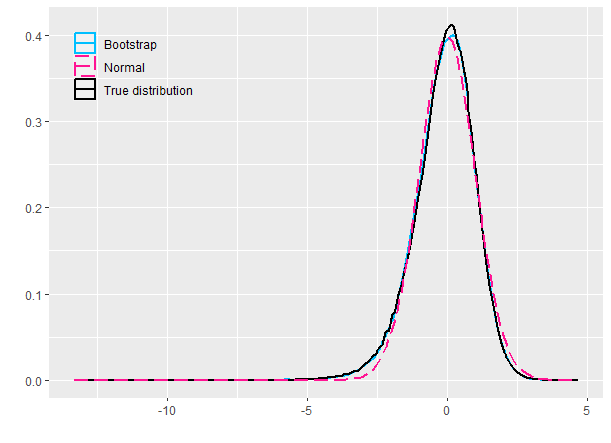
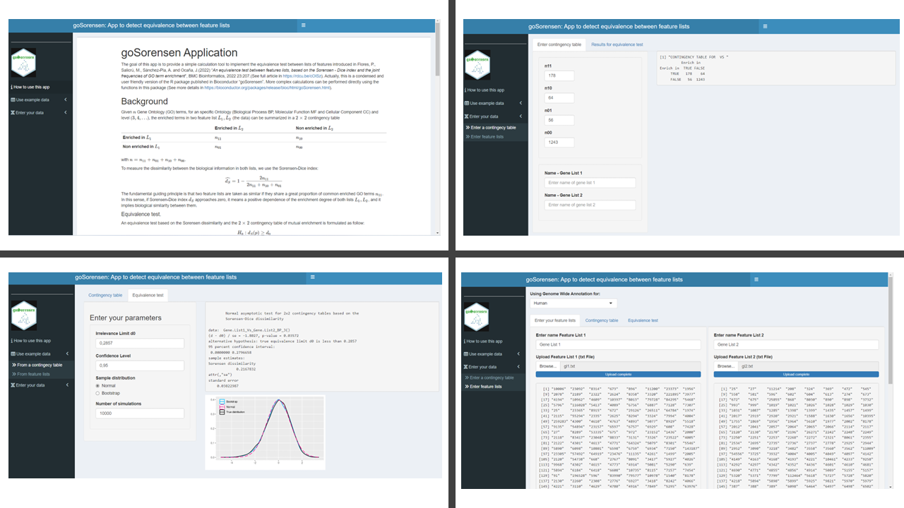
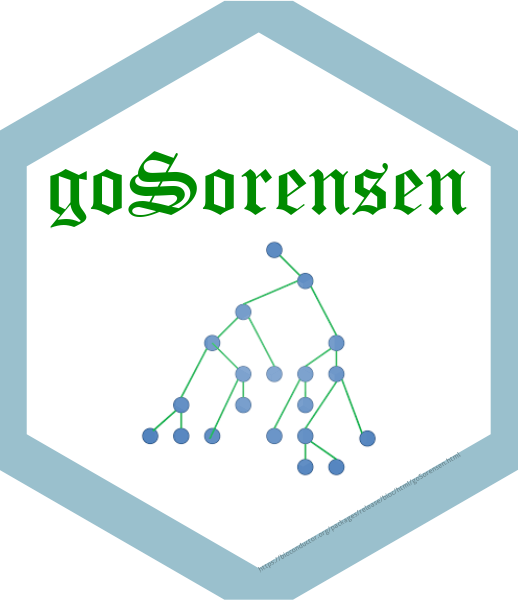

```{r setup, include=FALSE}
knitr::opts_chunk$set(echo = TRUE)
```

The goal of this app is to provide a simple calculation tool to implement the equivalence test between lists of features introduced in Flores, P., Salicrú, M., Sánchez-Pla, A. and Ocaña, J.(2022) "*An equivalence test between features lists, based on the Sorensen - Dice index and the joint frequencies of GO term enrichment*", BMC Bioinformatics, 2022 23:207.(See full article in <https://rdcu.be/cOISz>). Actually, this is a condensed and user friendly version of the R package published in Bioconductor "goSorensen". More complex calculations can be performed directly using the functions in this package (See more details in <https://bioconductor.org/packages/release/bioc/html/goSorensen.html>).

# Background

Given $n$ Gene Ontology (GO) terms, for an specific Ontology (Biological Process BP, Molecular Function MF and Cellular Component CC) and level ($3, 4, ...$), the enriched terms in two feature list $L_1, L_2$ (the data) can be summarized in a $2 \times 2$ contingency table

|                           | **Enriched in** $L_2$ | **Non enriched in** $L_2$ |
|-------------------------|----------------------|-------------------------|
| **Enriched in** $L_1$     | $n_{11}$              | $n_{10}$                  |
| **Non enriched in** $L_1$ | $n_{01}$              | $n_{00}$                  |

with $n = n_{11} + n_{01} + n_{10} + n_{00}$.

To measure the dissimilarity between the biological information in both lists, we use the Sorensen-Dice index:

$$ \widehat{d_S} =  1- \frac{2n_{11}}{2n_{11}+n_{10}+n_{01}}$$

The fundamental guiding principle is that two feature lists are taken as similar if they share a great proportion of common enriched GO terms $n_{11}$. In this sense, if Sorensen-Dice index $d_S$ approaches zero, it means a positive dependence of the enrichment degree of both lists $L_1, L_2$, and it implies biological similarity between them.

#### Equivalence test.

An equivalence test based on the Sorensen dissimilarity and the $2 \times 2$ contingency table of mutual enrichment is formulated as follow:

$$
H_0:  d_S(p) \ge d_0 \\
H_1:  d_S(p) < d_0
$$

where $d_0$ stands for a given equivalence limit or, in other words, a limit of dissimilarity irrelevance. In our context, equivalence to zero means equality to zero except for irrelevant deviations.

It has been shown that $\widehat{d_S}$ follows an asymptotically normal distribution $\widehat{d_S} \sim N(d_S, \sigma_{d_S}/\sqrt{n})$. However for poor levels of enrichment, it is preferable to use an approximate distribution such as that achieved with the bootstrap methodology. For example, using low mutual enrichment $n_{11}$. Figure 1 help to see the adjustment of Normal (pink line) and Bootstrap approximation(sky blue line) to the true distribution of Sorensen dissimilarity (black line) in a particular case of low enrichment.


{width=40%}

In this test, when $p-val$ obtained from normal or bootstrap distribution (depends of the best adjustment) is less that a given significance level $\alpha$, we reject $H_0$ and conclude that there is evidence to conclude that Sorensen dissimilarity is equivalent to zero ($d_S(p) < d_0$), it means biological similarity between feature lists.

# Using this app

## Installation
Source code of this Shiny App can be accessed via <https://github.com/pablof1988/goSorensenApp>. It can be used locally or integrated into any Shiny application server.

- R packages that need to be installed
  - `{BiocManager}` Together with `options(repos = BiocManager::repositories())` because packages from Bioconductor (different to CRAN) are necessary
  - `{shiny}`
  - `{shinydashboard}`
  - `{knitr}`
  - `{markdown}`
  - `{rmarkdown}`
  - `{goSorensen}`
  - `{ggplot2}`
  - In addition, some own R-functions to built the graphs of normal and botstrap adjustment are necessaries. These functions are in the `info` folder, in the `simfuncsPar.R` script and must be executed using `source("info/simfuncsPar.R")`
  
- Annotation data with Genome wide annotation for different species
  - `{org.Ag.eg.db}`
  - `{org.At.tair.db}`
  - `{org.Bt.eg.db}`
  - `{org.Ce.eg.db}`
  - `{org.Cf.eg.db}`
  - `{org.Dm.eg.db}`
  - `{org.Dr.eg.db}`
  - `{org.EcK12.eg.db}`
  - `{org.EcSakai.eg.db}`
  - `{org.Gg.eg.db}`
  - `{org.Hs.eg.db}`
  - `{org.Mm.eg.db}`
  - `{org.Mmu.eg.db}`
  - `{org.Mxanthus.db}` 
  - `{org.Pt.eg.db}`
  - `{shinydashboard}`
  - `{org.Rn.eg.db}`
  - `{org.Sc.sgd.db}`
  - `{org.Ss.eg.db}`
  - `{org.Xl.eg.db}`

This dependencies has to be installed with a R working version `R >=4.2.0`

## User manual
Below are some screen views of the app 

{}

To the left, in the black side bar of the app, the first option shows a manual of __How use this app__. Under this, there are two important options of analysis: __Use example data__ and  __Enter your data__. The computes that can be carried out in each tab are some intuitive when reading its name and are detailed below:

### Use example data
If user is not provided of data (identifiers of two or more feature lists to compare) and desire to see the outputs of the equivalence test explained above, it is his best option. In this tab, we can see the results from two kind of inputs in the next different sub tabs:

#### i) From a contingency table
In this section, we suppose that enrichment analysis from feature lists was done previously and lists are unknown. 

- In the first sheet of this sub tab called "__Contingency table__", a $2 \times 2$ contingency table with the number of enriched and non enriched terms in two feature lists in an specific ontology and GO level is provided. 
- In the second sheet of this sub tab called "__Equivalence test__", we compute the results of the equivalence test from the table shown in the previous sub tab. Results include: Sample distribution used (Normal or bootstrap), statistic test, p value, equivalence limit $d_0$, confidence interval  for an specific confidence level, Sorensen dissimilarity and the standard error of the test. In addition, a graph is shown with the adjustment that the normal distribution and bootstrap have to the true distribution of the data. Finally, it is important to mention that user can modify the irrelevance limit, confidence level, type of sample distribution and number of simulations used in computes and graph for the bootstrap distribution

#### ii) From feature lists

- In the sheet "__Select feature lists__", user can choose a couple of real lists of feature identifiers (more specifically genes) provided from <http://www.bushmanlab.org/links/genelists> . According to the description of the providers of these data "_this lists are collections of cancer related genes that were used to generate a comprehensive list (allOnco) that is comprised of the union of all them_". Genes use the ENTREZ identifiers and when lists are choose by user, the identifiers are displayed on the screen.
- From the feature lists selected above, a $2 \times 2$ contingency table with the number of enriched and non enriched terms is built in the sheet "__Contingency table__". In this section, user can select an specific Ontology and GO level to compute the contingency table. At first, computes are done for BP Ontology and GO level 3, if user want to choose a different option has to choose the desire parameters and click on the button "Compute"
- In sheet "__Equivalence test__" user can modify the irrelevance limit, confidence level, sample distribution used and the number of simulations to compute the results of the Sorensen equivalence test explained above in computes From a contingency table.  When user modifies some input, he must click on the button "Compute" to obtain the new results. It is important to mention that graph helps to decide what is the best sample distribution to choose to analyze a specific pair of lists.

### Enter your data
In this section, computes are very similar to the last ones, but now user can enter your own information from a contingency table or by  entering the feature lists IDs:

#### Enter a contingency table.
In this sub tab, feature lists IDs are not necessary. If user knows the number of enrichment and non enrichment GO terms, he can directly enter the $n_{11}, n_{10}, n_{01}, n_{00}$ elements of the $2 \times 2$ contingency table in the sheet "__Enter contingency table__". Optionally, name of lists can be provided and the table will be shown on the screen.

Finally, in the sheet "__Results for equivalence test__" the  outputs and graph are computed in the same way as for the cases of _Use example data_. Remember that the graph help to decide the methodology (Normal or Bootstrap) that best fits the real distribution of the data.

#### Enter feature lists
In this section, user can enter from an external txt file the __ENTREZ ID's__ of two feature lists to compare. User can choose to make the analysis for different species (Human, Anopheles, Arabipdosis, Bovine, Canine, Mouse, Chimp, Rat, Xenopus, etc...) using their corresponding __Genome Wide Annotation__ (Human by default).

In the sheet "__Enter your feature list__", once the user has uploaded the external txt file with the data (ENTREZ ID's) and optionally writes the name of the associated feature lists, the uploaded information will be displayed on the screen.

The another computes in the sheets "__Contingency table__" and "__Equivalence test__" are very similar to the explained in the above sections. The contingency table is built from the information uploaded and the user can decide an specific Ontology aand GO level. In teh same way, outputs of equivalence test and graphs to determine the best fitted distribution is computed from the inputs given by the user.

<br>

__NOTE:__ In all the cases where $2 \times 2$ contingency table of enrichment is built, the computes take some seconds. You have to be a little patient.

<br>

<div style="text-align: center">
{width=15%}
</div>

#### For question and comments:
Pablo Flores M.

<p_flores@espoch.edu.ec>